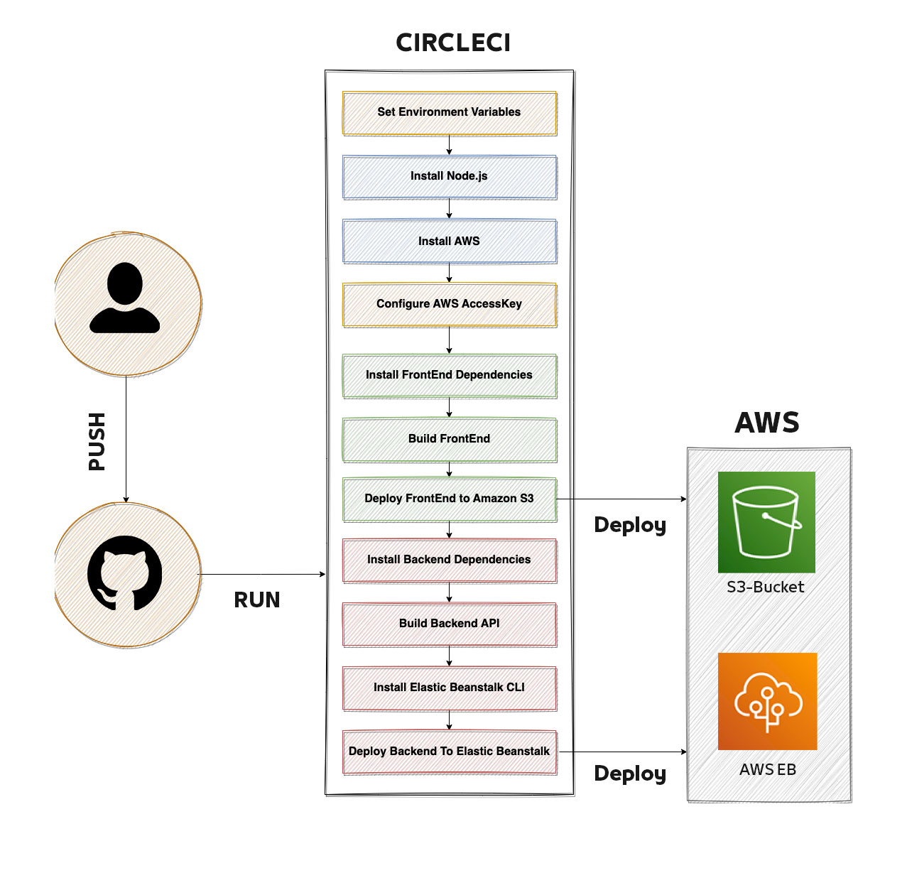
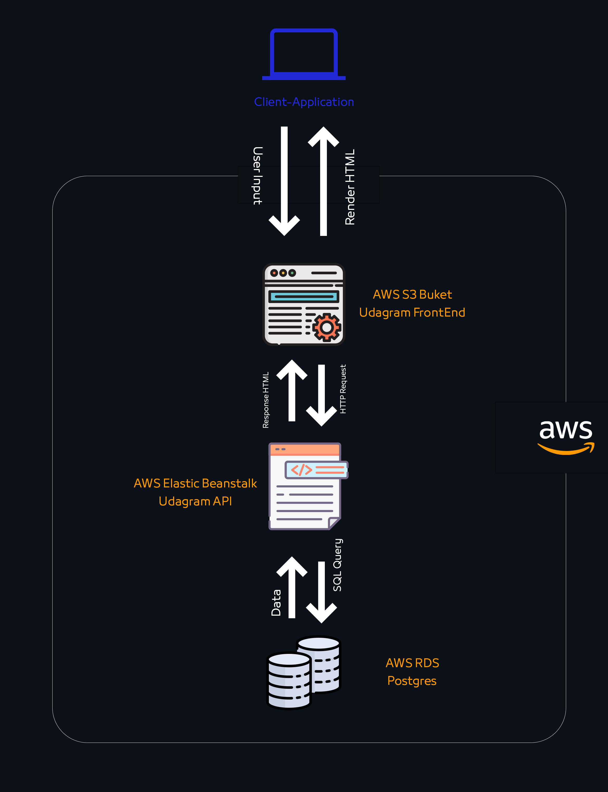

# CircleCI Pipeline


1. Developers Write/Modify/Refactor/Maintain/Test Code
2. PUSH the code on main GitHub Repository
3. After ***PUSH***, CircleCi will run script automatically.  
   1. Set environement variables
      ````
      POSTGRES_USERNAME
      POSTGRES_PASSWORD
      POSTGRES_HOST
      POSTGRES_DB
      AWS_BUCKET
      AWS_REGION
      AWS_PROFILE
      JWT_SECRET
      URL
      ````
    2. Install Node.js
    3. Install AWS CLI
    4. Configre AWS Accrss Key
    5. Install Front End Dependencies
    6. Build FrontEnd "***Angular***"
    7. Deploy FrontEnd to AWS-S3-Bucket
    8. Install Backend
    9. Build Backend Files
    10. Install EB CLI
    11. Deploy Backend to AWS Elastic Beans

4. At step 7 and 11 in previous Step, the code will integrate with aws to deploy the application.
5. Happy End. 
## Archticture Diagram


