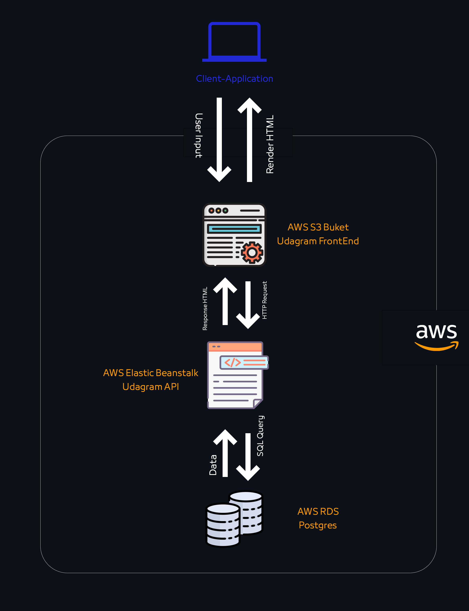

<h2>
  <center> Hosting a Full-Stack Application </center>
</h2>

<!-- [](https://dl.circleci.com/status-badge/redirect/gh/KShawki/Deploy/tree/main) -->

| AWS | http://test.eba-ewzp6atm.us-east-1.elasticbeanstalk.com/ |
| --- | -------------------------------------------------------- |

## About

The Project is for the Advanced Full-Stack Web Development Nanodegree Program - Deploying & Hosting a Full-Stack Application [3rd-Project].

## Usage

- Clone the project: `git clone https://github.com/KShawki/Deploy`
- Go to Folder: `cd Deploy`
- Setup Environment variables
- Run the Scripts
- Enjoy!

## Archticture Diagram



### Dependencies

```
- Node v14.15.1 (LTS) or more recent. While older versions can work it is advisable to keep node to latest LTS version

- npm 6.14.8 (LTS) or more recent, Yarn can work but was not tested for this project

- AWS CLI v2, v1 can work but was not tested for this project

- A RDS database running Postgres.

- A S3 bucket for hosting uploaded pictures.

```
g
## Built With

- [Angular](https://angular.io/) - Single Page Application Framework
- [Node](https://nodejs.org) - Javascript Runtime
- [Express](https://expressjs.com/) - Javascript API Framework
